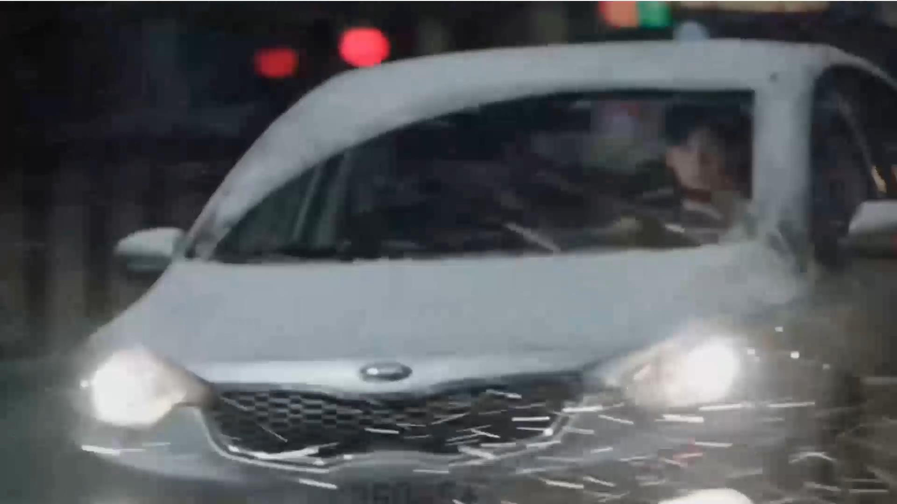
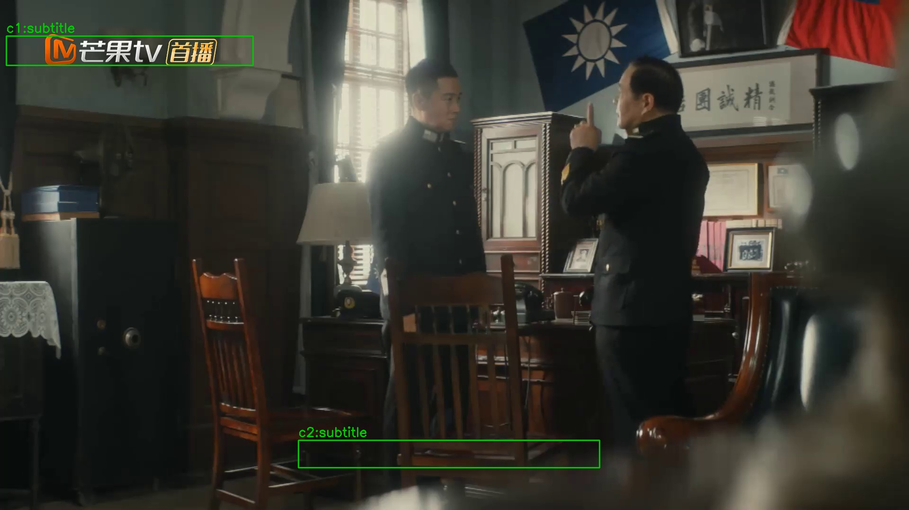
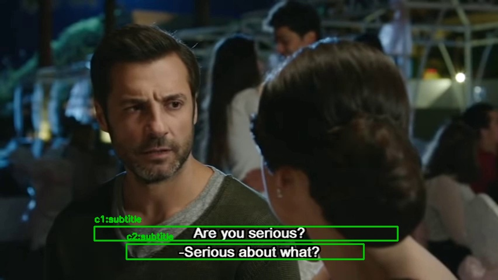
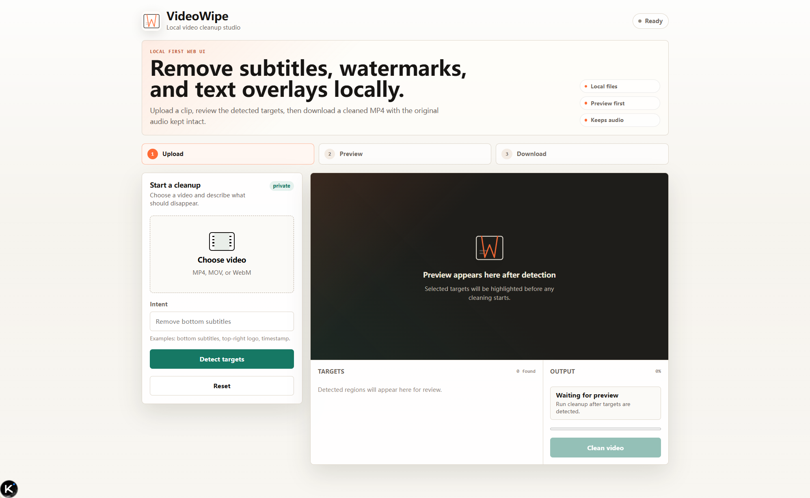
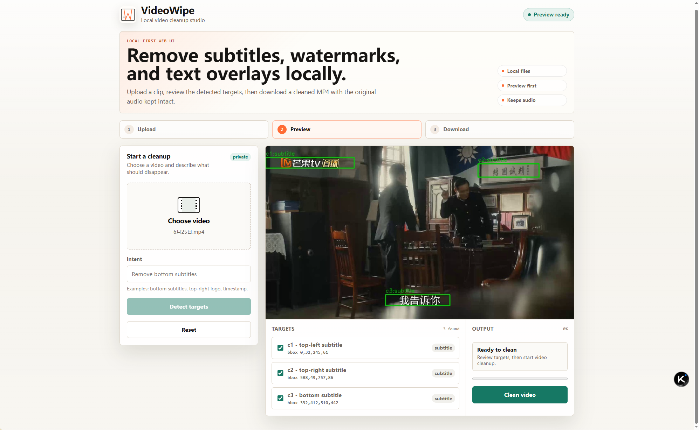
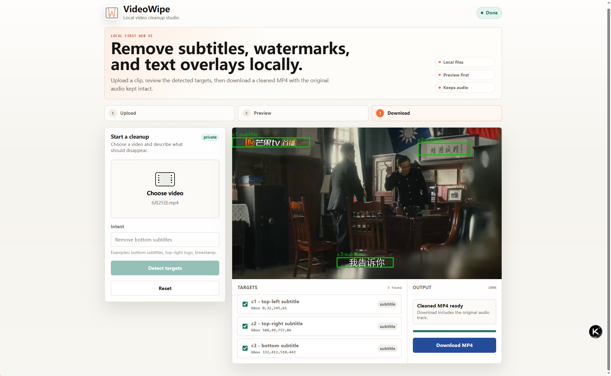

<p align="center">
  
</p>

<h1 align="center">VideoWipe</h1>

<p align="center">
  <strong>Open-source tool to remove hardcoded subtitles, watermarks, logos, and timestamps from video — locally.</strong>
</p>

<p align="center">
  Detect burn-in text · preview what will be removed · clean the background · keep the original audio.<br>
  No cloud upload. Works from CLI, a local web UI, Docker, or Python.
</p>

<p align="center">
  <a href="LICENSE"></a>
  
  
  
</p>

<p align="center">
  <a href="README_CN.md">中文</a>
  ·
  <a href="#quick-start">Quick start</a>
  ·
  <a href="#faq">FAQ</a>
  ·
  <a href="#docker">Docker</a>
</p>

---

## What is VideoWipe?

**VideoWipe** is an open-source, self-hosted video cleanup tool. It finds **hardcoded (burn-in) subtitles**, **watermarks**, **logos**, and **timestamps**, lets you **review** what to remove, then **inpaints** the covered pixels so the background looks continuous again.

Typical searches it answers:

- remove hardcoded subtitles from video
- remove watermark / logo from video (delogo)
- offline / local video text removal
- open-source alternative to online subtitle removers

Files stay on your machine. The cleaned MP4 keeps the **original audio track**.

> Not soft subtitles: VideoWipe does **not** strip `.srt` / `.ass` tracks. It removes text that is **burned into the picture**.

## Quick start

**Requirements:** Python 3.10+, and either ONNX Runtime or PyTorch. Model weights download automatically on first run to `~/.videowipe/weights/`.

VideoWipe is not on PyPI yet — install from source:

```bash
git clone https://github.com/KKenny0/videowipe.git
cd videowipe
pip install -e ".[onnx]"

# Auto-detect and remove hardcoded text overlays
videowipe clean input.mp4 -o result/
```

Prefer a browser UI (still local):

```bash
pip install -e ".[web,onnx]"
videowipe serve
# Open http://127.0.0.1:8000 — upload, preview tracks, download cleaned MP4
```

No Python? Use [Docker](#docker).

Optional extras: `.[torch]` (PyTorch), `.[ocr]` (OCR text recognition), `.[propainter]` (adapter deps only; model not bundled).

## Features

| | |
|--|--|
| **Hardcoded subtitle removal** | Burn-in / burned-in text, including multi-language clips |
| **Watermark, logo, timestamp cleanup** | Persistent corner marks and on-screen clocks |
| **Auto detection** | No hand-drawn mask required (you can still supply one) |
| **Preview before erase** | Review each track: remove or keep, with time ranges |
| **Local-first** | CLI, web UI, Docker, Python SDK — no cloud account |
| **Original audio preserved** | Cleaned video keeps the source soundtrack |
| **Multilingual detection** | Chinese, English, Korean, and more out of the box |
| **Pluggable quality** | Default STTN; optional [ProPainter](https://github.com/sczhou/ProPainter) or any external inpainting command |
| **Batch / embeddable** | Reuse one engine across many videos in your own worker |

## Demo

### Subtitle removal

| Before | After |
|--------|-------|
|  |  |

<p align="center"><a href="http://www.seeprettyface.com/mp4/video-inpainting/detext_06.mp4">Watch sample video</a></p>

### Auto-detection (no manual mask)

Built-in detector finds text regions across multilingual content:

<p float="left">
  
  
  
</p>

| Video | Candidates | Selected | Types |
|-------|-----------|----------|-------|
| Chinese drama | 4 | 2 | top subtitle, bottom subtitle |
| English clip | 2 | 2 | bottom subtitle |
| Music video (Korean + Burmese) | 7 | 5 | top watermark, bottom multilingual subtitles |

Tested with `--detect-mode balanced` (50 sampled frames). Green boxes show regions selected for cleanup.

### Local web UI

| Upload | Preview targets | Download |
|--------|-----------------|----------|
|  |  |  |

## Who is it for?

- **Creators & editors** cleaning archive footage before re-cut
- **Researchers & archivists** removing platform watermarks from reference clips (respect copyright and terms)
- **Anyone** who does not want to upload private video to a cloud “one-click remover”
- **Developers** who need a local pipeline: detect → review → inpaint, not a black-box website

### Common use cases

- Remove **burned-in bottom subtitles** from drama or lecture clips
- Clean a **corner logo / watermark** before reuse
- Strip **on-screen timestamps** or platform chrome
- On multilingual videos, **preview first**, then remove only the tracks you care about
- Run **batch jobs** on a worker without a desktop display

## How it works

Three stages:

1. **Detection** — Sample frames, find text regions, group them into stable tracks over time (multilingual, no manual mask required).
2. **Planning** — Build a reviewable **WipePlan**: each track has type (subtitle / watermark / logo / timestamp), remove|keep action, time segments, and a precise mask.
3. **Inpainting** — Only remove-track masks are applied per frame; default **STTN** fills from neighboring frames. Optional external models (e.g. ProPainter) plug in for higher quality.

You can stop after detection (`--preview`), edit the plan JSON, then run cleanup — so the tool does not erase blindly.

## VideoWipe vs alternatives

| | Online removers | Hand masks (AE / Resolve) | **VideoWipe** |
|--|-----------------|---------------------------|---------------|
| Privacy | Upload required | Local | **Local** |
| Auto-detect burn-in text | Sometimes | Manual | **Yes** |
| Review before erase | Rare | Manual | **Yes (plan / web UI)** |
| Cost | Subscription / credits | Labor | **Open source, self-hosted** |
| Embed in your pipeline | Hard | Hard | **Python SDK + CLI** |

### What VideoWipe is not

- Not a **soft subtitle** editor (`.srt` / `.ass`)
- Not a **translation** or re-caption product
- Not a promise of perfect pixels on every shot — fast motion and complex textures are harder; **preview first**
- Not a cloud SaaS — you run it yourself

## CLI usage

```bash
# Recommended: auto-detect and remove overlays
videowipe clean input.mp4 -o result/

# Only subtitles, only bottom of frame
videowipe clean input.mp4 --target subtitle --region bottom -o result/

# Natural-language intent
videowipe clean input.mp4 --intent "remove bottom Chinese subtitles" -o result/

# Preview detection only (no inpainting)
videowipe clean input.mp4 --preview -o plan/

# Execute a reviewed plan
videowipe clean input.mp4 --plan plan/wipe_plan.json -o result/

# Manual mask when you want full control
videowipe clean input.mp4 -m mask.png -o result/
```

#### `clean` options

| Flag | Description | Default |
|------|-------------|---------|
| `--target` | Target type (repeatable): `subtitle`, `timestamp`, `watermark`, `logo` | auto-detect all |
| `--region` | Screen region (repeatable): `top`, `bottom`, `top-left`, `top-right`, `bottom-left`, `bottom-right`, `center` | all regions |
| `--intent` | Natural-language cleanup intent | — |
| `--preview` | Write detection artifacts only (no inpainting) | off |
| `--plan` | Execute an existing `wipe_plan.json` (mutually exclusive with `-m, --mask`) | — |
| `--confirm` | Show detected targets and confirm before processing | off |
| `--detect-mode` | `fast` (24 frames); `balanced` (50) / `sensitive` (80) densely recheck detector-backed remove segments | `balanced` |
| `--ocr` | OCR: `auto`, `off`, `rapidocr` | `auto` |
| `--agent` | Local LLM CLI for intent-based selection (e.g. `claude`, `codex`) | — |
| `--external-command` | External inpainting command (bypasses built-in STTN) | — |
| `-g, --gap` | Segment length per pass; higher = better quality, slower | `200` |
| `-d, --dual` | Side-by-side original in the output | off |
| `-m, --mask` | Mask image path | auto |

<details>
<summary><strong>Legacy: detext command</strong></summary>

`detext` auto-detects subtitles only. Prefer `clean` for new usage.

```bash
videowipe detext -v input.mp4 -o result/
videowipe detext -v input.mp4 -m mask.png -o result/
```

| Flag | Description | Default |
|------|-------------|---------|
| `-v, --video` | Input video path | required |
| `-m, --mask` | Mask image path | auto |
| `-o, --output` | Output directory | `result/` |
| `-w, --weight` | Model weight path (PyTorch `.pth`/`.pt`, or ONNX prefix) | auto |
| `-g, --gap` | Segment length per pass | `200` |
| `-d, --dual` | Side-by-side original in the output | off |
| `--external-command` | External inpainting command | — |

</details>

## Docker

**CPU:**

```bash
docker pull ghcr.io/kkenny0/videowipe:latest
docker run --rm -v "$(pwd)":/data ghcr.io/kkenny0/videowipe clean /data/input.mp4 -o /data/result/
```

**GPU:**

```bash
docker pull ghcr.io/kkenny0/videowipe:gpu
docker run --rm --gpus all -v "$(pwd)":/data ghcr.io/kkenny0/videowipe:gpu clean /data/input.mp4 -o /data/result/
```

Or use the wrapper (auto-picks CPU/GPU):

```bash
./scripts/docker-videowipe.sh clean input.mp4 -o result/
```

| Image | Size | GPU | Notes |
|-------|------|-----|-------|
| `ghcr.io/kkenny0/videowipe:latest` | ~480 MB | No | CPU only, smallest |
| `ghcr.io/kkenny0/videowipe:gpu` | ~1.4 GB | Yes | Prebuilt GPU image |
| `videowipe:gpu` | ~1.4 GB | Yes | Local build tag |

Floating `latest` / `gpu` track the current main build. Pin versioned tags from GHCR after a successful release.

<details>
<summary><strong>Build from source</strong></summary>

```bash
docker build --target runtime-cpu -t videowipe:latest .
docker build --target runtime-gpu --build-arg VARIANT=gpu -t videowipe:gpu .
```

GPU image needs NVIDIA runtime for CUDA; otherwise ONNX Runtime falls back to CPU.

```bash
docker run --rm -v "$(pwd)":/data videowipe:latest clean /data/input.mp4 -o /data/result/
docker run --rm --gpus all -v "$(pwd)":/data videowipe:gpu clean /data/input.mp4 -o /data/result/
```

</details>

## Higher-quality inpainting (optional)

Default backend is **STTN** (works on CPU via ONNX). For tougher shots, plug in an external model.

[ProPainter](https://github.com/sczhou/ProPainter) is validated as a higher-quality option:

```bash
git clone https://github.com/sczhou/ProPainter.git ../models/ProPainter

videowipe clean input.mp4 --model propainter --propainter-dir ../models/ProPainter
# equivalent:
videowipe clean input.mp4 --external-command "python scripts/propainter_wipe.py"
```

> **Note:** ProPainter needs a GPU with ~16GB VRAM for 480p, and uses NTU S-Lab License 1.0 (non-commercial).

<details>
<summary><strong>Quality comparison: ProPainter vs STTN</strong></summary>

Multilingual music video (Korean + Burmese subtitles, 852×480, 10s). Same mask for both.

| Original | ProPainter (GPU fp16) | STTN (CPU ONNX) |
|----------|----------------------|-----------------|
|  |  |  |

</details>

## Python API (for pipelines)

The same engine powers CLI, web, and Docker. Use it when you want batch jobs or a custom worker.

```python
from videowipe import remove_text

# Mask optional — regions auto-detected if omitted
remove_text(video="input.mp4", output="result/")
```

Full clean pipeline with target selection:

```python
from videowipe import WipeEngine

engine = WipeEngine(task="clean", detect_mode="balanced", ocr="auto")
engine.process(
    video="input.mp4",
    targets=["subtitle", "watermark"],
    regions=["bottom"],
    intent="remove Chinese subtitles and logo watermark",
    output="result/",
)
engine.cleanup()
```

Batch with a long-lived engine (model stays loaded):

```python
from videowipe import CancellationToken, WipeEngine, WipeRequest

with WipeEngine(task="detext") as engine:
    result = engine.run(
        WipeRequest(video="clip1.mp4", mask="mask.png", output_dir="result/clip1"),
        cancellation=CancellationToken(),
    )
    print(result.output_path, result.backend, result.timings)
```

See [examples/batch_worker.py](examples/batch_worker.py) and [examples/custom_inpainter.py](examples/custom_inpainter.py).

<details>
<summary><strong>Review and edit the WipePlan</strong></summary>

Generate a plan without loading the inpainting model, edit track `action` / `segments` in JSON (do not edit the sidecar `.npz` masks), then execute:

```python
from videowipe import CancellationToken, WipeEngine, WipeRequest

engine = WipeEngine(task="clean")
plan = engine.plan(
    WipeRequest(video="input.mp4", output_dir="plan/"),
    cancellation=CancellationToken(),
)
engine.cleanup()

with WipeEngine(task="clean") as engine:
    result = engine.run(WipeRequest(
        video="input.mp4",
        output_dir="result/",
        plan="plan/wipe_plan.json",
    ))
```

```bash
videowipe clean input.mp4 --preview -o plan/
videowipe clean input.mp4 --plan plan/wipe_plan.json -o result/
```

The plan is ordinary JSON — no LLM or cloud required. A plan is bound to its source video.

</details>

## FAQ

**Does VideoWipe remove soft subtitles (`.srt` / `.ass`)?**  
No. Soft tracks are separate files or streams. VideoWipe removes **hardcoded / burn-in** text painted into the video frames.

**Do my videos leave my computer?**  
Default path is fully local (CLI, web UI on `127.0.0.1`, Docker with a bind mount). Nothing is uploaded to a VideoWipe cloud.

**Is the original audio kept?**  
Yes. Downloaded / output MP4 keeps the source audio track.

**Do I need a GPU?**  
No. CPU + ONNX Runtime works. GPU images and PyTorch/ProPainter paths are faster or higher quality when available.

**Is it on PyPI?**  
Not yet. Install from this repo or pull the Docker image.

**Hardcoded subtitle vs watermark — can I choose?**  
Yes. Use `--target subtitle` / `--target watermark` / `--region bottom`, natural-language `--intent`, or the web UI track toggles.

**STTN or ProPainter?**  
STTN is the default (lighter, CPU-friendly). ProPainter often looks better on hard regions but needs more VRAM and a non-commercial license for that model.

**Will cleanup always look perfect?**  
No tool can guarantee that. Fast motion, thin textures, and semi-transparent marks are harder. Use **preview / confirm** before a long run.

**Can I plug this into my own product or worker?**  
Yes. Treat VideoWipe as an embeddable engine: one `WipeEngine`, stable request/result types, optional custom inpainters. Product boundary is detect → plan → inpaint — not a full NLE or cloud studio.

## Support

If VideoWipe saves you time on subtitle, watermark, or overlay cleanup:

<https://kkenny0.github.io/support/>

Support helps maintain model packaging, Docker images, detection tuning, and docs.

## Credits

Built on [STTN](https://github.com/researchmm/STTN) and the original [Video-Auto-Wipe](https://github.com/a312863063/Video-Auto-Wipe). Built-in text detection from [OnnxOCR](https://github.com/jingsongliujing/OnnxOCR).

## License

GNU General Public License v3.0 — see [LICENSE](LICENSE).

This repository derives from GPL-3.0-licensed Video-Auto-Wipe. If you distribute VideoWipe or a combined work, review the GPL-3.0 obligations for your distribution model.
