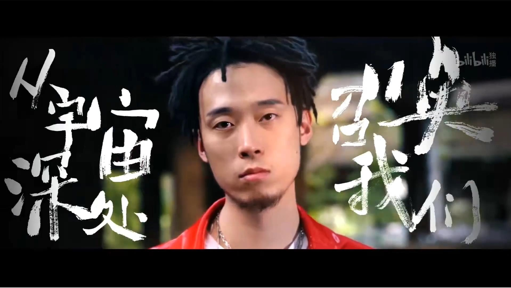
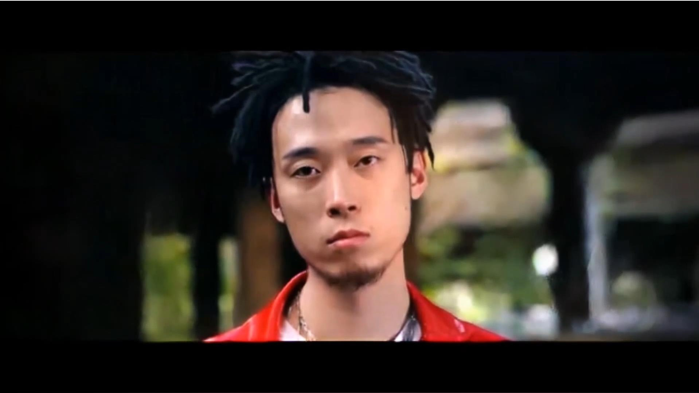

<h1 align="center">videowipe</h1>

<p align="center">
  基于 STTN 的视频修复库。<br>
  擦除字幕、台标、水印，<code>pip install videowipe</code> 即可使用。
</p>

<p align="center">
  <a href="README.md">English</a>
</p>

---

## 功能

videowipe 使用时空 Transformer 网络检测并擦除视频中的固定模式内容：硬字幕、台标、动态水印。你提供视频和标记擦除区域的 mask 图片，模型利用前后帧的时域信息填充背景。

## 安装

需要 Python 3.8+ 和 PyTorch。

```bash
# 已有 PyTorch：
pip install videowipe

# 需要安装 PyTorch（CPU 版）：
pip install videowipe[cpu]
```

模型权重在首次运行时自动下载到 `~/.videowipe/weights/`，无需手动配置。

## 使用

### Python API

```python
from videowipe import remove_text

# 处理单个视频
remove_text(
    video="input.mp4",
    mask="mask.png",
    output="result/",
)
```

批量处理时复用引擎，避免重复加载模型：

```python
from videowipe import WipeEngine

engine = WipeEngine(task="detext")
engine.process(video="clip1.mp4", mask="mask.png", output="result/")
engine.process(video="clip2.mp4", mask="mask.png", output="result/")
engine.cleanup()
```

### CLI

```bash
videowipe detext -v input.mp4 -m mask.png -o result/
videowipe detext -v input.mp4 -m mask.png -o result/ -g 400
videowipe delogo -v input.mp4 -m mask.png -o result/
```

### 参数

| 参数 | 说明 | 默认值 |
|------|------|--------|
| `-v, --video` | 输入视频路径 | 必填 |
| `-m, --mask` | Mask 图片路径 | 必填 |
| `-o, --output` | 输出目录 | `result/` |
| `-w, --weight` | 模型权重路径（设置后跳过自动下载） | 自动下载 |
| `-g, --gap` | 每轮处理的分段长度，值越大效果越好、速度越慢 | `200` |
| `-d, --dual` | 输出中同时显示原视频 | 关闭 |

## 效果预览

### 字幕擦除

| Before | After |
|--------|-------|
|  |  |

<p align="center"><a href="http://www.seeprettyface.com/mp4/video-inpainting/detext_06.mp4">查看视频</a></p>

### 台标擦除

| Before | After |
|--------|-------|
|  |  |

<p align="center"><a href="http://www.seeprettyface.com/mp4/video-inpainting/delogo_04.mp4">查看视频</a></p>

### 动态水印擦除

| Before | After |
|--------|-------|
|  |  |

<p align="center"><a href="http://www.seeprettyface.com/mp4/video-inpainting/de_dynamic_logo.mp4">查看视频</a></p>

## 原理

模型基于 STTN（时空 Transformer 网络），8 层 transformer block 对多尺度 patch 做时域注意力。CNN 编码器提取帧特征，跨帧注意力机制利用邻近帧和参考帧信息，解码器生成修复结果。

性能优化：Numba 加速帧混合、AMP 混合精度推理、`channels_last` 内存布局。23 秒测试视频处理时间 125s。

## 致谢

基于 [STTN](https://github.com/researchmm/STTN) 和 [Video-Auto-Wipe](https://github.com/a312863063/Video-Auto-Wipe)。

## License

MIT
